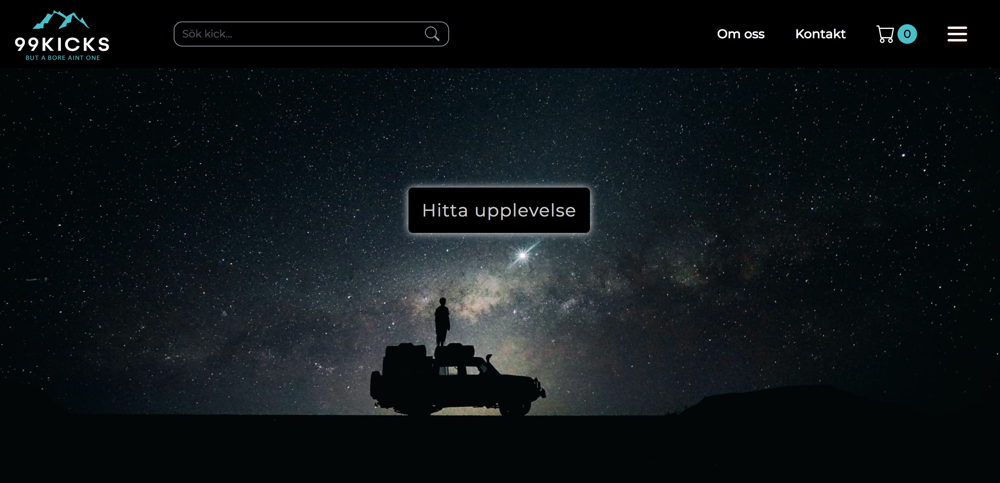

# Webshop
Group project in school, built with TypeScript and SASS. The website features basic functionality such as adding/removing items in the shopping cart.

## Screenshot

## Installation
1. Clone the repo\
git clone https://github.com/malin-nilsson/Webshop

2. Install npm packages\
npm install

3. Run Parcel\
npm run build

Visit localhost:1234 to view the project

## Built with
- HTML & SASS
- TypeScript
- Bootstrap
- NPM

## Details
Malin: Worked on shopping functionality such as adding items to cart, removing items, calculating total, and clearing shopping cart after purchase. Also created styling and layout for the landing page, product page and shopping cart page.  
Michael: Created the nav bar and mobile hamburger menu. Worked on form validation on checkout page as well as layout for checkout page.  
Emma: Produced our amazing logo, favicon and coded the transitions to our modals.

## Contributors
Malin Nilsson  
Michael Miikkulainen  
Emma Nilsson
